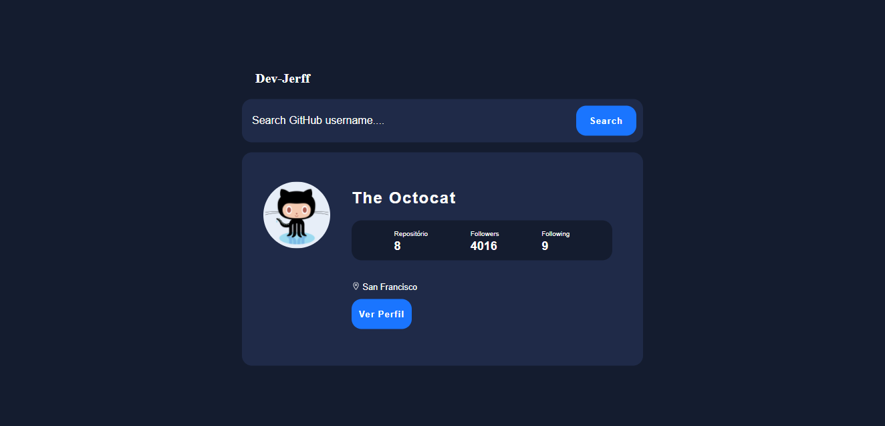

# API GitHub 
<h1 align="center">
    
</h1>

:writing_hand:📚	

##  :hammer_and_wrench: Tecnologias :

Esse projeto foi desenvolvido com as seguintes tecnologias e sites:

- [React](https://reactjs.org/)
- [styled-components](https://styled-components.com/)
- Javascript
- API do [GitHub](https://docs.github.com/pt)

# Instruções

 ### `yarn start` se tiver o [yarn](https://classic.yarnpkg.com/en/docs/install#windows-stable) instalado, se não execute `npm start`
 
 * Abra [http://localhost:3000](http://localhost:3000) para visualizá-lo no navegador.
 
 #### :warning: Se caso acontecer algum erro de `'react-scripts' is not recognized as an internal or external command` :warning:
 * execute `yarn add install react-scripts --save` ou `npm install react-scripts --save`
 

# Getting Started with Create React App

This project was bootstrapped with [Create React App](https://github.com/facebook/create-react-app).

## Available Scripts

In the project directory, you can run:

### `yarn start` or `npm start`

Runs the app in the development mode.\
Open [http://localhost:3000](http://localhost:3000) to view it in the browser.

The page will reload if you make edits.\
You will also see any lint errors in the console.
